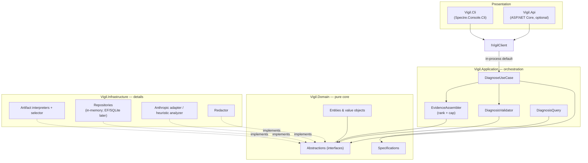
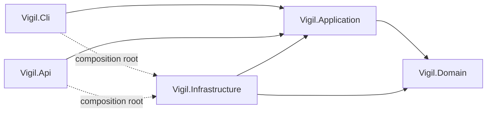
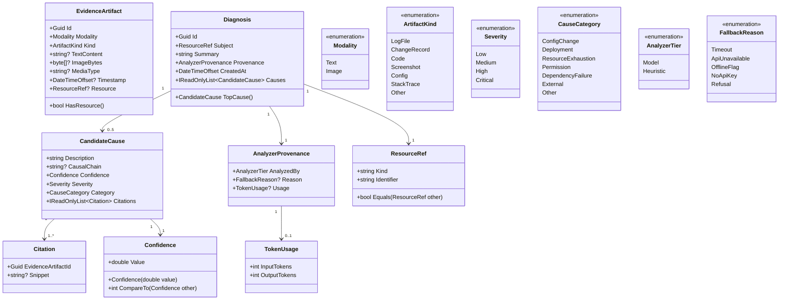
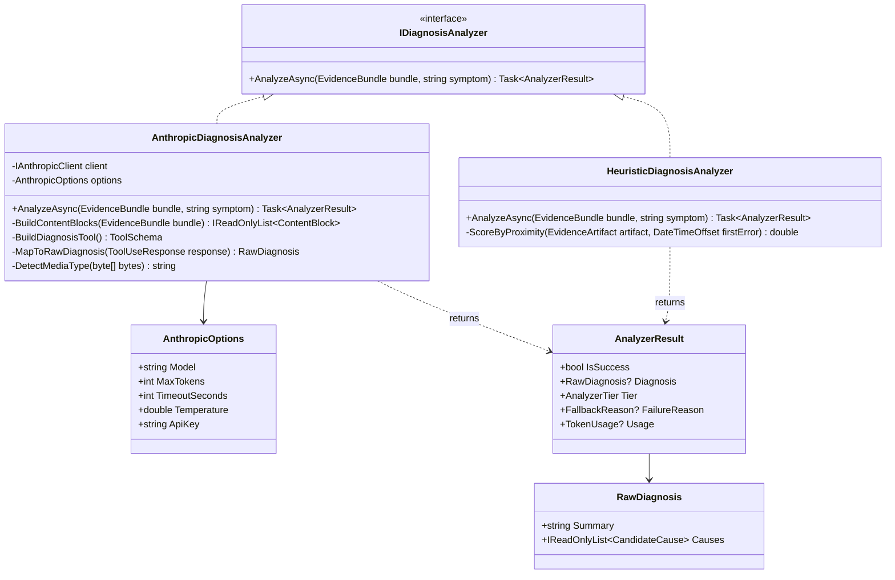
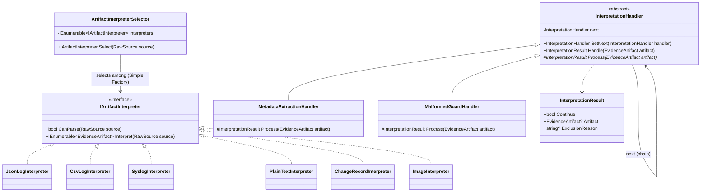
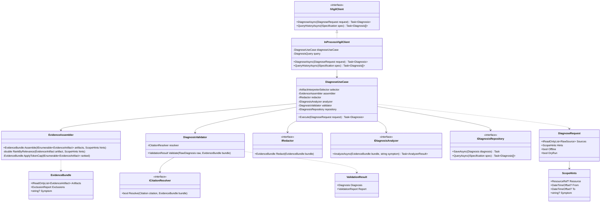
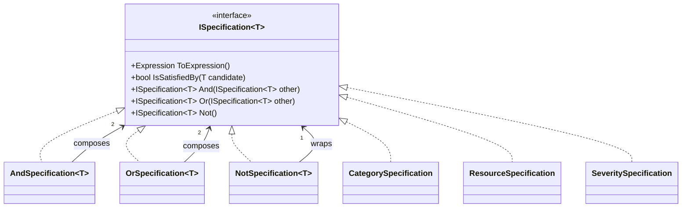
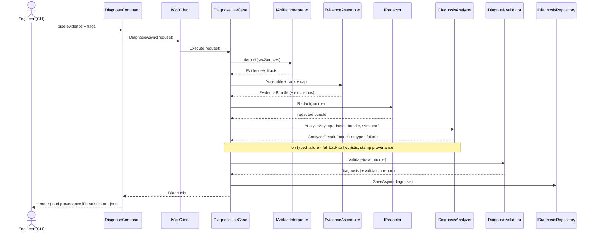
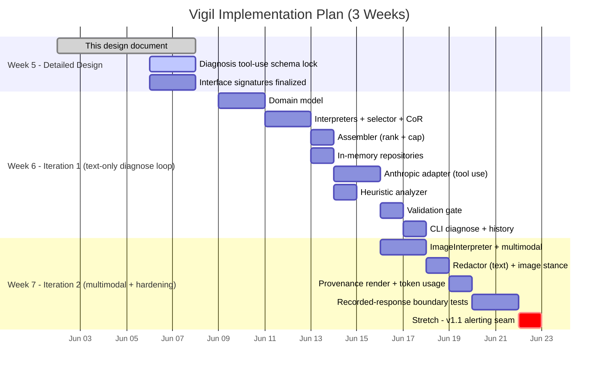

# Vigil — Diagram Source (Mermaid for Lucidchart)

**How to use this file.** In Lucidchart, open a document → left toolbar → **Diagram as code** → paste one block below → it renders instantly. Do this once per diagram. Lucid supports Mermaid (optimized for v11.14) for class, sequence, flowchart, state, C4, Gantt, and ERD types — all the types used here. The render is a static image on the canvas; to restyle, edit the code and click **Update**.

**Conventions used (for Lucid compatibility):**
- Nullable reference types (`?`) are shown only on fields/properties. Method-parameter nullability is described in the design doc prose, not in the diagram, because nested/edge-case generics and `?` inside method parens can trip Lucid's Mermaid parser.
- Collection returns are written as `Task~T[]~` (parser-safe) where the actual contract returns `IReadOnlyList<T>` — noted in the doc.
- If any single block fails to render in Lucid, the fix is almost always to simplify one signature (drop a generic nesting); the structure is what matters for the grade, not the exact return type.

Diagram order matches the design document's placeholder callouts.

---

## Diagram 1 — Architecture: component & layer overview (flowchart)

---

## Diagram 2 — Dependency direction (compile-time project references)

---

## Diagram 3 — Domain model (class diagram)

---

## Diagram 4 — Analyzer / AI adapter hierarchy (class diagram)

> **Teaching note (state in the doc, not the diagram):** `IAnthropicClient`, `ContentBlock`, `ToolSchema`, and `ToolUseResponse` are SDK-facing types. They appear **only** as private members/return types of `AnthropicDiagnosisAnalyzer`. That confinement is the Adapter pattern working: no SDK type crosses the `IDiagnosisAnalyzer` seam into Application or Domain.

---

## Diagram 5 — Artifact interpretation: Strategy + Simple Factory + Chain of Responsibility + Template Method (class diagram)

> **Design note (state in the doc):** two distinct mechanisms are shown together. (1) `ArtifactInterpreterSelector` picks *one* `IArtifactInterpreter` per source via `CanParse` — **Simple Factory selection over Strategy** (explicitly **not** Factory Method: it selects among existing strategies, it does not defer instantiation to subclasses). (2) `InterpretationHandler` is the **Chain of Responsibility + Template Method** that runs ordered processing stages over the produced artifacts; `Handle` is the fixed template (run `Process`, forward only when `Continue` is true), `Process` is the per-stage hook, and a malformed artifact short-circuits the chain into the exclusions report rather than throwing. The exact set of handler stages is an implementation-time detail to lock in Week 6; the pattern structure is fixed.

---

## Diagram 6 — Application orchestration (class diagram) — headline diagram

> **Why this is the headline diagram (state in the doc):** `DiagnoseUseCase` depends only on Domain-owned abstractions (`IRedactor`, `IDiagnosisAnalyzer`, `ICitationResolver`, `IDiagnosisRepository`) — the structural proof of Dependency Inversion. It is also where the instructor's "how does the model perform the action, and how do you verify it" question is answered as *structure*: the model call (`IDiagnosisAnalyzer`) and the deterministic gate (`DiagnosisValidator`) are separate collaborators, so the stochastic step is isolated and the verification step is independently testable.

---

## Diagram 7 — Specification + Composite (class diagram) — optional, strengthens the patterns section

> **Note (state in the doc):** `ToExpression()` returns `Expression<Func<T, bool>>` — the EF-Core-translatable form, shown here as `Expression` for parser safety. The And/Or/Not specifications **hold** other `ISpecification<T>` instances, which is the Composite relationship. Combining the underlying expression trees requires parameter rebinding via an `ExpressionVisitor` (not `Expression.Invoke`, which EF Core cannot translate).

---

## Diagram 8 — The diagnose pipeline (sequence diagram)

---

## Diagram 9 — Implementation schedule (Gantt)

> **Adjust the dates to your actual calendar.** Week 5 = this design doc (in progress); Weeks 6 and 7 are the two build iterations. The plan is sequenced so each week ends with something demonstrable.

