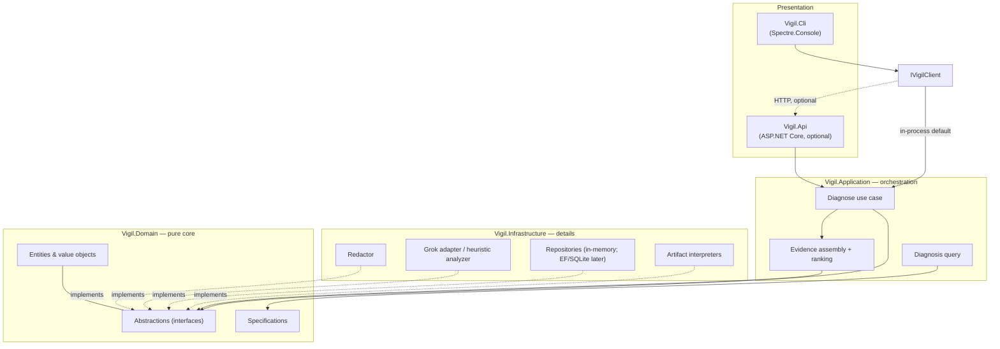
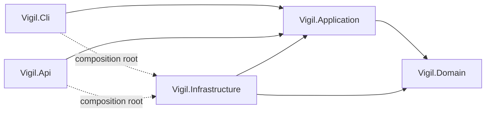
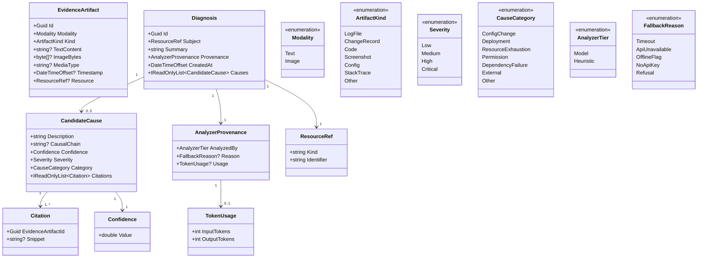
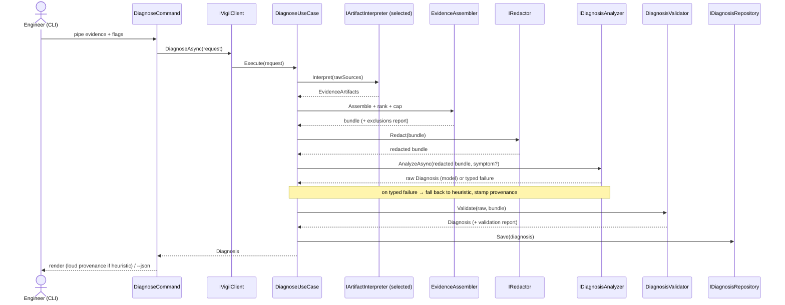
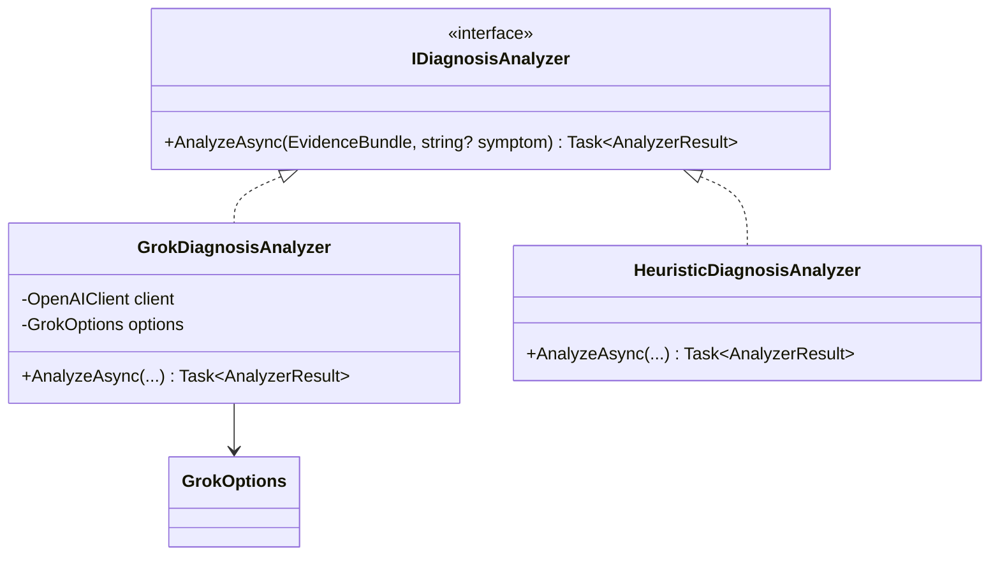
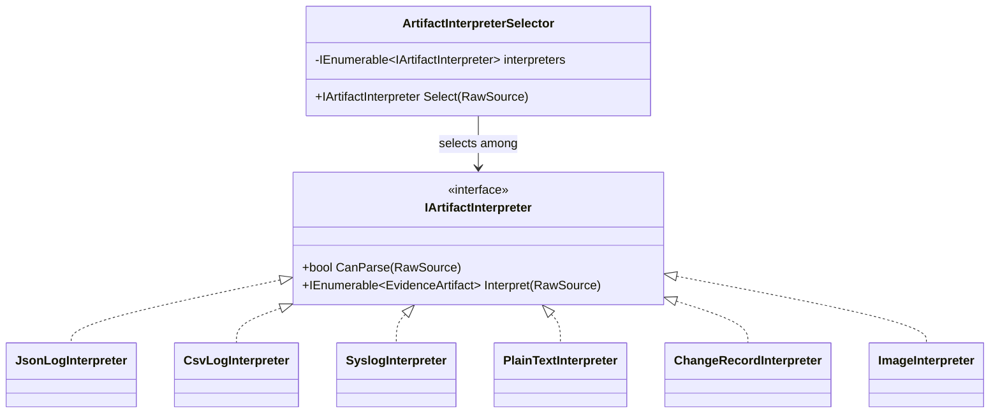

# Vigil — Systems Design

**An incident-diagnosis engine for systems and platform work.**
Status: design finalized, pre-implementation. Stack: C# / .NET 8.

---

## 1. What Vigil is

Operational infrastructure emits a constant trail of evidence — diagnostic logs, change records, config snapshots, stack traces, terminal screenshots. Most of it sits idle until something breaks, at which point an engineer gathers whatever fragments seem relevant and tries to reconstruct what happened.

Vigil is the tool that does that reconstruction. An engineer hands it the evidence they have about a problem, and Vigil returns a **governed, cited, ranked diagnosis**: what most likely broke, why, and the specific records that support each conclusion.

The accepted evidence is bounded only by what the active analyzer can read. With the Grok model that means text and images — so logs, change records, code, configs, stack traces, and screenshots are all first-class inputs. No single artifact type is the center; change records are one `Kind` among many.

### The thesis: model as infrastructure, not conversation

For a single small incident, an engineer pasting logs into a chat window and asking "what broke?" gets a comparable answer. Vigil does not win on a smarter prompt. It wins by being the model wrapped in the governance, determinism, and integration that make a model usable as **infrastructure** instead of a one-off conversation. Six things a chat window structurally cannot provide, and which justify the entire architecture:

1. **A trust contract.** Every claim cites the record IDs behind it; ungrounded claims are provably rejected; scores are bounded; output is capped. At 3am the engineer needs "show me the evidence," not "trust me."
2. **Data governance.** Logs and change records carry secrets. Vigil masks text before anything leaves the machine, and an offline tier lets sensitive incidents be analyzed with nothing leaving the box at all.
3. **Evidence assembly at scale.** Deterministic gathering, relevance ranking, and a hard cap — with an explicit record of what was excluded — instead of a human hitting context limits and introducing selection bias by hand.
4. **Repeatability and integration.** A scriptable, pipeable artifact that runs the identical pipeline every time and wires into existing tooling. Infrastructure, not a session.
5. **Institutional memory.** Diagnoses are persisted and queryable: "has this break happened before, and what did we conclude?" A chat forgets every time.
6. **Normalization.** Heterogeneous sources are interpreted into one structure first, which is also what makes stable, per-record citations possible.

Everything below traces back to one of these six. A pattern that doesn't is decoration and doesn't belong.

---

## 2. Design principles

- **Clean / Onion architecture; dependencies point inward only.** The Domain is a stable center that references nothing external. This is the structural form of the Dependency Inversion Principle: concrete details (interpreters, repositories, the AI SDK) implement interfaces *owned by the Domain*.
- **Dependency direction enforced by project references**, not convention. The Domain literally cannot reference a framework type because the project has no such reference.
- **Depth over breadth.** A small interface hiding a large, well-tested implementation. Leverage for callers, locality for maintainers. Patterns are adopted only where they genuinely arise.
- **Determinism wrapped around a stochastic core.** The model is the only non-deterministic element. Everything around it — evidence assembly, the output schema, citation validation, the output cap — is deterministic and testable. "The model judges; the system constrains and verifies."
- **Security is an infrastructure concern at the edges.** Secrets live at the composition root; redaction happens immediately before the external egress; neither touches the inner layers.

---

## 3. Architecture overview

Five projects across four layers. `Infrastructure` is referenced **only** by the entry points (`Api`, `Cli`) and **only** for dependency-injection wiring — the composition root. No business logic references Infrastructure.

### Dependency direction (compile-time project references)

### Transport: `IVigilClient`

Presentation reaches the core through one seam. The in-process implementation (`InProcessVigilClient`) is the default runtime — serverless, single process, and the natural shape for a future desktop GUI, which would embed `Vigil.Application` the same way. An HTTP implementation (`HttpVigilClient` over `Vigil.Api`) is built and available for a future web frontend or remote/cloud deployment, but is not required to run the tool. Swapping between them is a composition-root decision; no other code changes.

**The load-bearing rule:** presentation carries zero business logic. A command gathers input, calls `IVigilClient.DiagnoseAsync(request)`, and renders the result. Nothing else. That single discipline is what keeps a future GUI a clean add rather than a rewrite.

---

## 4. Domain model

Entities have identity (`Id`); value objects are immutable C# records with value equality.

Key modeling decisions:

- **`Confidence` is a value object, not a bare `double`,** so the 0–1 invariant lives in one place and is enforced at construction. Out-of-range values are rejected at the boundary, never silently clamped downstream.
- **`Citation` points at an `EvidenceArtifact.Id` (record-level).** The optional `Snippet` is for human findability and is *not* used for validation — validation is purely "does this ID resolve against the assembled bundle." Finer granularity (line/region) is a future swap behind `ICitationResolver` and requires interpreters to assign stable sub-IDs; deliberately out of v1.
- **`AnalyzerProvenance` is mandatory and always rendered.** A diagnosis must declare which tier produced it. Silent degradation violates the trust contract.
- **Retired concepts:** `Anomaly`, `DeviationScore`, and `AnalysisSubject` from earlier drift-detection framing are gone. `DeviationScore` (distance from a baseline) is meaningful only for a future proactive-drift mode and is parked until then.

---

## 5. The diagnose pipeline

One on-demand flow. The stochastic step is isolated; everything around it is deterministic.

### Stage detail

1. **Gather (presentation).** stdin is the primary stream (pipe live command output); additional named sources via repeatable flags; optional scope hints. No business logic here.
2. **Interpret (Infrastructure).** An `IArtifactInterpreter` is selected per source by content sniffing; it produces `EvidenceArtifact`s and extracts cheap metadata (timestamps, resource references where present). The model does the understanding; interpretation is light.
3. **Assemble + rank + cap (Application).** Gather artifacts, rank by relevance (temporal proximity to the incident window, severity signals, resource match), and truncate to a token budget. Excluded items are recorded, not dropped silently.
4. **Redact (Application, before egress).** `IRedactor` masks secrets in text. Images are **not** auto-redacted in v1 — see §8.
5. **Analyze (`IDiagnosisAnalyzer`).** Either the model tier (§7) or the heuristic tier (§8). A typed failure from the model tier causes a fall-back to the heuristic with provenance stamped.
6. **Validate (the deterministic gate, §6).**
7. **Render + persist.** Human-rendered by default; `--json` for piping onward; the `Diagnosis` is saved for institutional memory.

---

## 6. The validation gate

This is what converts "the model produced output" into something auditable. A fixed, fully testable sequence applied to every model response:

1. **Deserialize** the structured (tool-use) response against the `Diagnosis` schema. Malformed output fails here, deterministically.
2. **Resolve citations** per cause via `ICitationResolver` against the assembled bundle.
3. **Drop / strip.** A cause with at least one resolving citation is kept; its non-resolving citations are stripped and the cause is flagged *partially grounded*. A cause with **zero** resolving citations is an unsupported assertion — dropped.
4. **Rank and truncate** survivors by `Confidence`; keep the top 5. (The cap is also requested of the model so it prioritizes; this is the deterministic backstop it cannot override. Truncation happens *after* citation validation so a high-confidence hallucination cannot crowd out a grounded cause.)
5. **Emit** the `Diagnosis` plus a validation report recording every drop and strip.

The floor: **everything the engineer sees has at least one real record behind it.** A hallucinated citation either resolves against the bundle or it doesn't — a binary, deterministic check in C#, expressible as a unit assertion with no live API call.

---

## 7. The AI integration (Adapter)

The Grok adapter (`GrokDiagnosisAnalyzer`, Infrastructure) translates the SDK into the Domain's `IDiagnosisAnalyzer` interface so SDK types never leak inward.

How the model performs the diagnosis, specifically:

- **Multimodal input.** The bundle is serialized into chat completion message content parts — text parts for logs/code/change records/configs/stack traces, base64 image parts for screenshots. **Media type is detected from the image's magic bytes, not its file extension** (a PNG sent as `image/jpeg` is a hard 400; this is one of the most common vision-integration bugs). Images are validated for size and dimensions before the part is built.
- **Structured output via tool use.** A tool is defined whose input schema *is* the `Diagnosis` shape — ranked causes, each with confidence, severity, category, and citations. The model is constrained to emit JSON matching that schema. There is no free-text-then-parse step; malformed output fails deserialization deterministically at the validation gate.
- **Determinism levers.** Low temperature; the schema constraint; the citation-grounding requirement (the prompt instructs the model to cite the artifact IDs it relied on); the ≤5 cap requested in-prompt and enforced after.
- **Failure handling.** SDK exceptions — timeout, refusal, API unavailable, missing key — are caught at the adapter boundary and translated into a typed `AnalyzerResult` failure. SDK exception types never propagate past Infrastructure. On failure the use case falls back to the heuristic tier and stamps `FallbackReason` onto the diagnosis.

### Configuration, secrets, and cost

The key is a secret and is treated as a cross-cutting infrastructure concern owned by the composition root.

- **Never hard-coded; never in a file inside the repo.** The adapter receives a `GrokOptions` object (the .NET options pattern) injected at the composition root, holding the API key plus non-secret knobs (model, max tokens, timeout, optional base URL override). It does not go looking for the key, which also keeps it unit-testable. The adapter uses the official `OpenAI` NuGet client, configured at construction time to target the xAI endpoint (`https://api.x.ai/v1`) while presenting the same `IDiagnosisAnalyzer` contract.
- **Config layering, secret out of the tree.** `appsettings.json` is committed and holds only non-secrets (model, max-tokens, timeout). Local development supplies the key via the `XAI_API_KEY` environment variable or .NET User Secrets (stored in the user profile, outside the project directory, so it cannot be committed). Production/cloud uses a secret manager (e.g. Azure Key Vault) surfaced through the same configuration system — only the *provider* changes, never the adapter code.
- **No key → offline, not a crash.** If no key is configured, the composition root defaults to the heuristic `IDiagnosisAnalyzer` and tells the user plainly. The auth concern resolves through an existing seam.
- **Cost is metered per token** (input = bundle + prompt, output = diagnosis) against the account the key belongs to; there is no per-call invoice. The architecture already bounds cost: rank-and-cap bounds input tokens, the ≤5 cap and max-tokens bound output tokens, the heuristic/offline tier costs zero, and `--dry-run` previews the bundle without spending a call. Model selection is the one cost knob, exposed in `GrokOptions` as config (typical values: `grok-4.3` or `grok-3-latest`). Token `usage` from the response is captured onto `AnalyzerProvenance` so Vigil observes its own cost per run.

---

## 8. Evidence assembly, scoping, and redaction

- **Scoping is by optional hints, not gates.** `--resource`, a time window, and a free-text `--symptom` narrow assembly when supplied. If omitted, assembly includes everything provided and ranks by intrinsic signals, and the model self-determines scope. Under-specifying is safe **because of the citation floor** — a model that wanders and invents a cause is caught at the validation gate. The grounding contract is what buys the freedom to under-specify.
- **Overflow → rank-and-cap (v1).** The same relevance ranking that orders the bundle decides what survives a token budget; exclusions are reported. Map-reduce over summarized chunks is a future option behind the same seam.
- **Redaction runs in the core, immediately before the adapter call** — never in presentation. There are two hops and only one is a boundary: presentation → core carries raw data but never leaves the machine (local / in-process, not an egress); core → xAI (Grok) is the external egress, and redaction is upstream of it.
- **Images are not auto-redacted in v1.** Regex masking cannot see a token in a screenshot. v1's honest stance: text is masked; images are sent with a loud warning; `--offline` refuses to send images at all. OCR-based image masking lives behind the same `IRedactor` seam for later. Images will not quietly carry secrets past the egress boundary.
- **Future remote-host caveat.** If `Vigil.Api` is ever hosted remotely, the presentation → core hop becomes a network egress too, at which point client-side redaction becomes an option behind the same `IRedactor` seam. Out of v1 scope; the seam makes it a later config decision, not a rewrite.

---

## 9. The offline / heuristic tier

A second `IDiagnosisAnalyzer` implementation that satisfies the identical `Diagnosis` contract — proving the seam is real, not decorative.

- **Algorithm (deliberately minimal):** rank `ChangeRecord` and timestamped artifacts by temporal proximity to the first error and by resource match; emit the top causes with a **templated** description ("change {id} to {resource} occurred {N}s before the first error"), a `Confidence` from a proximity/match formula, a `Severity` from log levels, and citations to exactly the records used (so grounding is trivially perfect). Same ≤5 cap, same contract.
- **Why it earns its place** despite being cheap: it is a true Liskov substitute (same input bundle, same `Diagnosis` out, differing only in *how* it scores and describes — formula+template vs. reasoning+prose), which is the cleanest demonstration that the analyzer seam is legitimate; it is the governance/offline path (`--offline`: nothing leaves the box); it is the fallback when the live call fails; it is the deterministic test double for the validation gate; and "what changed right before it broke" is genuinely the #1 real-world root cause, so it is a meaningful baseline that makes the model's added value *measurable by contrast*.
- **Honesty is the expensive, load-bearing part.** When `AnalyzedBy = Heuristic`, rendering leads with a warning panel ("offline / heuristic mode — no AI analysis performed; results are a mechanical proximity ranking, not a diagnosis"). The score column is labeled **proximity**, not confidence. Descriptions are visibly templated. The `--json` path carries the same provenance so a downstream consumer cannot mistake a heuristic ranking for an AI diagnosis.
- **The fallback *decision* lives in the use case** (try model → on typed failure, invoke heuristic), not in the adapter. The adapter's only job is translating SDK failures into a typed result. Extending failure handling later (retry/backoff, fall back to a cached prior diagnosis) is a use-case edit, no new abstraction.

---

## 10. Interpretation: artifacts in

Getting data in is the usual friction point, and Vigil's value is *heterogeneous* sources while the most seamless channel — a Unix pipe — is a *single* stream. The reconciliation:

- **stdin is the primary stream.** Pipe live command output with no export step:
  `journalctl -u nginx --since "14:00" | vigil diagnose --symptom "intermittent 500s after deploy"`
- **Additional named sources via repeatable flags:** `--logs`, `--changes`, `--image` (repeatable). stdin is the unnamed primary stream; everything else is explicit. This is how heterogeneity coexists with one pipe.
- **No `--format` in the common case.** Format is auto-detected by each interpreter's `CanParse` (the Simple Factory selection over `IArtifactInterpreter` strategies). `--format` exists only as an override for ambiguous input. The engineer declares *what broke*, never *what shape the bytes are*.
- **Dual output.** Human-rendered by default (a Spectre tree: ranked causes, each expandable to confidence, severity, category, and cited records); `--json` for piping onward. The `--json` path is what makes Vigil *infrastructure* — a diagnosis pipeable into a ticket-creator or notifier.
- **`--dry-run`** shows exactly what evidence *would* be assembled and sent — and what was redacted or excluded by the cap — without spending a model call. The trust contract made tangible.

**Two implementation gotchas, both load-bearing:**
- **Cannot interactively prompt for the symptom when stdin is a pipe** — stdin is consumed by the data, so a keystroke cannot be read from it. Rule: `--symptom` is a flag; an interactive prompt is only a fallback when stdin is a TTY.
- **Stream, do not slurp.** A piped command can produce enormous output; the parse path reads incrementally and feeds rank-and-cap rather than loading everything into memory to discard most of it.

### Interpretation as a short-circuiting chain

Per-artifact interpretation is a Chain of Responsibility with a Template Method base: a base handler orchestrates (run `Process`, forward only on `Continue`); subclasses override `Process`. A malformed artifact short-circuits the chain (it should not reach later stages), and the failure feeds the validation/exclusions report rather than throwing. This is genuine short-circuit behavior, not an always-every-stage pipeline.

---

## 11. Persistence and querying

- **Repository pattern** over all storage. v1 uses in-memory repositories; an EF Core + SQLite implementation is a later swap behind the same interface. Storage is a detail.
- **Diagnoses are persisted** — this is what makes institutional memory (differentiator #5) real rather than claimed.
- **Querying past diagnoses** by category, resource, and severity via `ISpecification<Diagnosis>` composed with And/Or/Not (Specification + Composite). "Show me every `ResourceExhaustion` incident on this host this month" is the institutional-memory query that proves the tool is more than a chat window.
- **Specifications expose `Expression<Func<T,bool>>`, not just `IsSatisfiedBy`.** An in-memory predicate cannot translate to SQL; with EF Core it would silently load every row and filter client-side. The expression form lets the same specification translate to SQL later and evaluate in-memory now. (Combining expression trees requires parameter rebinding via an `ExpressionVisitor` or a predicate-builder; naive `Expression.Invoke` is not EF-translatable.)

---

## 12. Patterns in use

Each pattern is led by the *axis of change it isolates* — the test of whether it is earned rather than decorative.

| Pattern | Where | Axis of change it isolates |
|---|---|---|
| **Strategy** | `IArtifactInterpreter`, `IDiagnosisAnalyzer` | Input format varies independently of the pipeline; analysis tier (model vs heuristic) varies independently of orchestration. |
| **Simple Factory (selection)** | `ArtifactInterpreterSelector` | Selecting an interpreter via `CanParse` so callers never branch on format. (Selection among existing strategies — explicitly **not** GoF Factory Method; it does not defer instantiation to subclasses.) |
| **Chain of Responsibility** (short-circuit) | Interpretation pipeline | Each stage is one responsibility; stages are reorderable/insertable; a malformed artifact terminates the chain. |
| **Template Method** | Interpretation handler base | The forward-on-`Continue` orchestration is fixed; per-stage `Process` varies. |
| **Adapter** | `GrokDiagnosisAnalyzer` | The third-party SDK's shape (OpenAI-compatible) varies independently of the Domain contract; SDK types stay out of the core. The adapter targets xAI's Grok endpoint. |
| **Repository** | `I*Repository` | Storage technology varies independently of use cases. |
| **Command** | Spectre CLI commands | Each request is encapsulated as an object; aligns with the Spectre command model. |
| **Specification + Composite** | `ISpecification<Diagnosis>` | Query/filter criteria vary and compose without predicate sprawl. |
| **Observer** *(v1.1)* | `AlertDispatcher` + channels | Diagnosis *production* varies independently of *consumption*/delivery. |

---

## 13. Error-handling philosophy

- **Exceptions only for the exceptional.** Parse failures, ungrounded citations, and over-cap are *expected* and flow through a Result/Notification model (the validation + exclusions report), not thrown exceptions.
- **AI failures are caught at the adapter boundary** and become typed results; SDK exception types never leak past Infrastructure.
- **Infrastructure/repository errors propagate** and, when the HTTP transport is in use, are translated to RFC 7807 ProblemDetails at the API edge.
- **Never silently degrade.** Any fallback to the heuristic tier is stamped on provenance and surfaced to the engineer.

---

## 14. Roadmap

Decoupling diagnosis *production* from *consumption* in v1 is what makes everything below additive rather than surgery.

**v1 — the diagnose loop.** Full pipeline end-to-end; text *and* image artifacts; model tier + proximity heuristic with honest provenance; structured, cited, validated output (≤5 causes); in-memory persistence; query past diagnoses by category/resource/severity; CLI with stdin + flags, `--offline`, `--json`, `--dry-run`; configuration/secrets at the composition root. Demonstrates Strategy, Simple Factory, Chain of Responsibility, Template Method, Adapter, Repository, Command, Specification, Composite.

**v1.1 — on-diagnosis alerting.** When a diagnose run completes, evaluate `ISpecification<Diagnosis>` rules against the produced diagnosis and route it to channels: `AlertDispatcher` (Observer subject), `IAlertChannel` (Strategy), `AlertRule` + persistence. Hung off the diagnosis return value — no change to the diagnose path. Adds Observer and completes the Specification justification. The rule condition becomes an `ISpecification<Diagnosis>` (severity threshold, confidence floor, resource match, category); rules may live in config/in-memory initially.

**Later — seams reserved, not built.** Proactive `watch` mode (schedule/trigger `diagnose`, fire the same v1.1 rules — reactive and proactive share the analyzer seam, differing only in whether a symptom is supplied); line/region-level citations (requires stable sub-IDs from interpreters); OCR-based image redaction; map-reduce for oversized evidence; remote API host + client-side redaction; EF Core + SQLite persistence.
